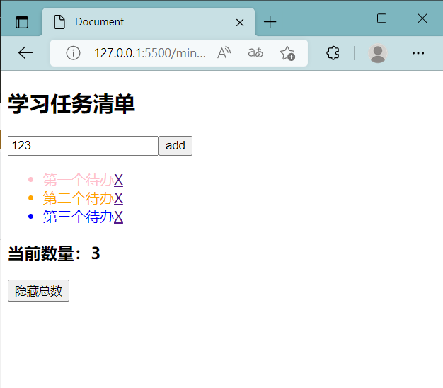

[toc]
# Mini-app 小程序运行时
- 基于 `WebWork` 的双线程结构，隔离用户逻辑与dom的操作权限
- 基于 `Proxy` 与 `发布订阅模式` 实现数据驱动的响应式框架
- 使用 `vdom` 实现 dom 的渲染
- 提供系统组件 `TodoList`

## 1. demo 效果



- index.html
```html
<!DOCTYPE html>
<html lang="zh">
<head>
    <meta charset="UTF-8">
    <meta name="viewport" content="width=device-width, initial-scale=1.0">
    <title>MiniApp</title>
</head>
<body>
    <script src="./dist/index.js"></script>
</body>
</html>
```
- index.js
``` js
import { app, render, reactive, TodoList } from './src'

const App = {
    setup() {
        const add = () => {
            state.value++
        }
        const inputHandler = (__domp) => {
            state.input.value = __domp.v
            console.log('inputHandler:', state)
        }
        const hiddenHandler = ()=> state.isHidden=!state.isHidden

        let state = reactive({
            title: "学习任务清单",
            list: [
                { text: '第一个待办', color: 'pink' },
                { text: '第二个待办', color: 'orange' },
                { text: '第三个待办', color: 'blue' }
            ],
            input: { value: '123' },
            value: 1,
            isHidden:false
        })

        return () => (
            <div>
                <TodoList 
                    title  ={state.title}
                    list   ={state.list} 
                    value  ={state.input} 
                    oninput={inputHandler} >
                </TodoList>
                {state.isHidden?<div></div>:<h3>当前数量：{Object.keys(state.list).length}</h3>}
                <button onClick={hiddenHandler}>{state.isHidden?'显示总数':'隐藏总数'}</button>
            </div>
        )
    }
}

app(App)

```
### 1.1 页面效果说明
- 输入框可以向待办列表添加项目
- 项目中的×可以删除该项目
- 底部显示项目总数
- 底部的按钮可以显示/隐藏项目总数
### 1.2 系统组件TodoList的使用：
```html
<TodoList 
    title  ={state.title}
    list   ={state.list} 
    value  ={state.input} 
    oninput={inputHandler} >
</TodoList>
```
- title : 待办列表的标题
- list : 待办事项数组，如 `[{text:'A', color:'red'}, {text:'B'}]`
- value : input输入框dom.value双向绑定的数据，如 `{value:'初始默认值'}`
- oninput : 绑定一个特定的回调函数

## 2. 双线程通信
1. 主线程 : view 线程
   - 生成数据代理
   - 接收 work 线程的 commit 消息
   - 根据 commit 消息中的 vdom 生成真实的 dom 元素
   - 有事件触发时，向 work 线程发送 event 消息
2. WebWorker线程 : work 线程
   - 数据依赖收集 
     - Proxy中的get方法调用track进行依赖收集
   - 生成vdom 
   - 新旧vdom的diff
   - 向 view 线程发送 commit 消息
   - 接收 view 线程的 event 消息，执行 event 绑定的用户函数

## 3. 响应式设计
- 参考资料：[reactive + effect + track + trigger 实现响应式系统](https://cloud.tencent.com/developer/article/2054897)
1. reactive : 生成 Proxy
   - Proxy 支持对象与数组 
2. track 依赖收集
   - 当数据被读取时，Proxy 的 get 方法会调用 track 函数，将相关effect函数加入该数据的依赖集合
3. tricker 触发器
   - 当数据被修改时，Proxy 的 set 方法会调用tricker 函数，执行该数据的依赖集合中的函数，对相关元素进行更新

## 参考资料
- [frontend-framework-exercize](https://github.com/QuarkGluonPlasma/frontend-framework-exercize)
- [voe](https://github.com/sxzxiaofeng/voe)
